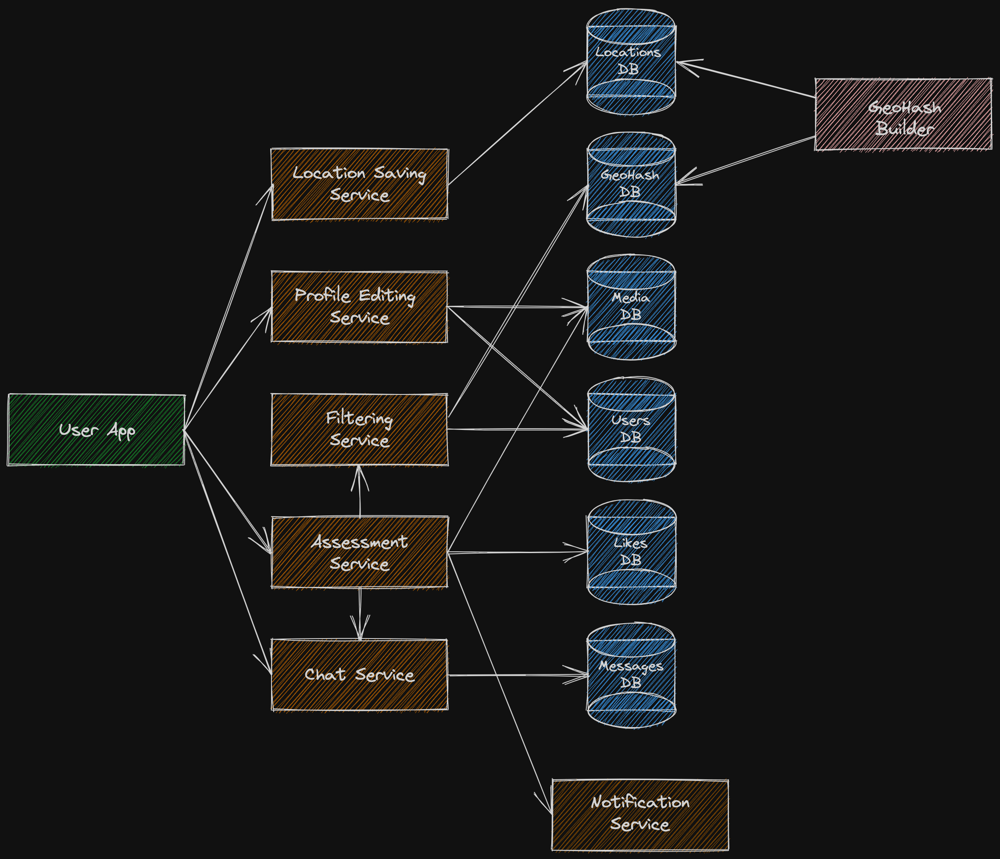

# Global Dating Service Design  

## Overview
This project was developed as part of a **System Design course** in Fall 2023.  
The goal of this project was to design a **global dating service** similar to Tinder.  
The system includes a **mobile application** and a **web interface**, available and localized in multiple countries.  

## Scope Refinement  

### Included Features ✅  
- **Profile creation** – Users can create and manage their dating profiles.  
- **Matchmaking** – Efficient algorithms for finding potential matches.  
- **Real-time chat** – Instant messaging between matched users.  

### Excluded Features ❌  
- **Admin & moderation tools** – No functionality for superuser management.  
- **Reporting system** – No handling of user complaints or content moderation.  
- **Media sharing** – No support for sending images or videos in chat.  
- **Location tracking & logs** – No storage of user movement history.  

## Functional and non-functional requirements
see [requirements.md](requirements.md)

## Estimations(Traffic, load, network, storage, hardware, cost)
see [estimations.md](estimations.md)

## High-Level Design  
A broad architectural overview of the system:  

  

## Detailed Design  
A deeper look into the internal components and interactions:  

  

### Overview  
The system includes **replication, load balancing, and message queues** where necessary.  

- **Apache Kafka** is used as a message queue for real-time chats.
- **Likes Database** – PostgreSQL is chosen to support efficient **JOIN** operations. 
- **Messages Database** – Cassandra is selected for its scalability.
- **isOnline Database** – Redis is used as a **key-value store** for quick access to online status.
- **Media Database** – S3 is used as an **object storage** solution for media files. 
- **Users Database** – MongoDB is preferred for its flexibility in storing user preferences in an unstructured format.
- **Location obfuscation** – User coordinates are **hashed and rewritten within Cassandra** to prevent tracking of movement patterns.

### Sharding Strategy  
Sharding is based on **cities**, ensuring an even distribution of load. To balance traffic across shards, **smaller cities are grouped into clusters** comparable in size to major metropolitan areas like **New York**.  

